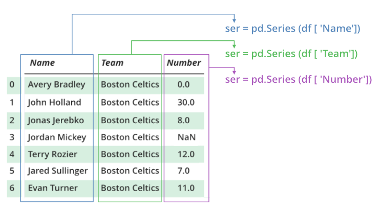
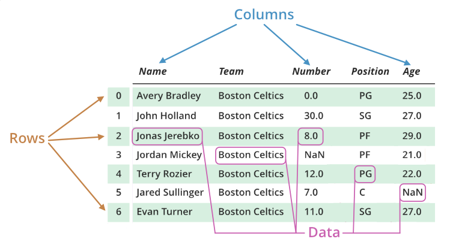

# Pandas Basics

- **Pandas** is a high-level data manipulation tool.
- It is built on the **Numpy** package and its key data structure is called the **DataFrame**.
- **DataFrames** allow you to store and manipulate tabular data
  in rows of observations and columns of variables.

## Table of Contents

<!-- START doctoc generated TOC please keep comment here to allow auto update -->
<!-- DON'T EDIT THIS SECTION, INSTEAD RE-RUN doctoc TO UPDATE -->

- [Concepts](#concepts)
  - [Pandas Series](#pandas-series)
  - [Pandas DataFrame](#pandas-dataframe)
- [Creating Pandas DataFrames](#creating-pandas-dataframes)
  - [From Python Dictionaries](#from-python-dictionaries)
  - [From `.csv` Files](#from-csv-files)
- [Indexing Pandas DataFrames](#indexing-pandas-dataframes)
- [References](#references)

<!-- END doctoc generated TOC please keep comment here to allow auto update -->

## Concepts

### Pandas Series

> **Pandas Series** is a one-dimensional labeled array
> capable of holding data of any type (integer, string, float, Python objects, etc.).
> The axis labels are collectively called index.
> Pandas Series is nothing but a column in an excel sheet.
> Labels need not be unique but must be a hashable type.
> The object supports both integer and label-based indexing
> and provides a host of methods for performing operations involving the index.

<div align="center"></div>

### Pandas DataFrame

> **DataFrame** is a 2-dimensional
> labeled data structure with columns of potentially different types.
> You can think of it like a spreadsheet or SQL table, or a dict of Series objects.
> It is generally the most commonly used pandas object.

<br />

> **Pandas DataFrame** is two-dimensional size-mutable,
> potentially heterogeneous tabular data structure with labeled axes (rows and columns).
> A DataFrame is a two-dimensional data structure,
> i.e., data is aligned in a tabular fashion in rows and columns.
> Pandas DataFrame consists of three principal components, the data, rows, and columns.

<div align="center"></div>

<br />

- heterogeneous `/ˌhetərəˈdʒiːniəs/` adjective
  consisting of many different kinds of people or things
  hỗn tạp, đa dạng

- tabular `/ˈtæbjələ(r)/` adjective
  presented or arranged in a table (= in rows and columns)

- axes `/ˈæk.siːz/`
  plural of axis `/ˈæksɪs/`

- analogous `/əˈnæləɡəs/` adjective
  analogous (to/with something)
  similar in some way to another thing or situation and therefore able to be compared with it
  tương tự

- matrices `/ˈmeɪtrɪsiːz/`
  plural of matrix `/ˈmeɪtrɪks/`

- cater `/ˈkeɪtə(r)/` verb
  to provide food and drinks for a social event
  cung cấp thực phẩm, lương thực
  phục vụ cho, mua vui cho, giải trí cho
  e.g. this programme caters for the masses
  chương trình này phục vụ cho quảng đại quần chúng

<!-- AUTO-GENERATED-CONTENT:START (CODE:src=dictionary.md) -->
<!-- The below code snippet is automatically added from dictionary.md -->
```md
# Dictionary

## Vocabulary

<!-- START doctoc generated TOC please keep comment here to allow auto update -->
<!-- DON'T EDIT THIS SECTION, INSTEAD RE-RUN doctoc TO UPDATE -->


- [heterogeneous](#heterogeneous)
- [tabular](#tabular)
- [axes](#axes)
- [analogous](#analogous)
- [matrices](#matrices)
- [cater](#cater)

<!-- END doctoc generated TOC please keep comment here to allow auto update -->

<!-- AUTO-GENERATED-CONTENT:END -->

## heterogeneous

heterogeneous `/ˌhetərəˈdʒiːniəs/` adjective
consisting of many different kinds of people or things
hỗn tạp, đa dạng

## tabular

tabular `/ˈtæbjələ(r)/` adjective
presented or arranged in a table (= in rows and columns)

## axes

axes `/ˈæk.siːz/`
plural of axis `/ˈæksɪs/`

## analogous

analogous `/əˈnæləɡəs/` adjective
analogous (to/with something)
similar in some way to another thing or situation and therefore able to be compared with it
tương tự

## matrices

matrices `/ˈmeɪtrɪsiːz/`
plural of matrix `/ˈmeɪtrɪks/`

## cater

cater `/ˈkeɪtə(r)/` verb
to provide food and drinks for a social event
cung cấp thực phẩm, lương thực
phục vụ cho, mua vui cho, giải trí cho
e.g. this programme caters for the masses
chương trình này phục vụ cho quảng đại quần chúng
```
<!-- AUTO-GENERATED-CONTENT:END -->

## heterogeneous

heterogeneous `/ˌhetərəˈdʒiːniəs/` adjective
consisting of many different kinds of people or things
hỗn tạp, đa dạng

## tabular

tabular `/ˈtæbjələ(r)/` adjective
presented or arranged in a table (= in rows and columns)

## axes

axes `/ˈæk.siːz/`
plural of axis `/ˈæksɪs/`

## analogous

analogous `/əˈnæləɡəs/` adjective
analogous (to/with something)
similar in some way to another thing or situation and therefore able to be compared with it
tương tự

## matrices

matrices `/ˈmeɪtrɪsiːz/`
plural of matrix `/ˈmeɪtrɪks/`

## cater

cater `/ˈkeɪtə(r)/` verb
to provide food and drinks for a social event
cung cấp thực phẩm, lương thực
phục vụ cho, mua vui cho, giải trí cho
e.g. this programme caters for the masses
chương trình này phục vụ cho quảng đại quần chúng
```

<!-- AUTO-GENERATED-CONTENT:END -->

> Arithmetic operations align on both row and column labels.
> Can be thought of as a dict-like container for Series objects.
> The primary `pandas` data structure.

- So, the **Series** is the data structure for a single column of a **DataFrame**,
  not only conceptually, but literally,
  i.e. the data in a **DataFrame** is actually stored in memory as a collection of **Series**.

- Analogously: We need both lists and matrices,
  because matrices are built with lists.
  Single row matrices,
  while equivalent to lists in functionality still cannot exist
  without the list(s) they're composed of.

- They both have extremely similar APIs,
  but you will find that **DataFrame** methods always cater to the possibility
  that you have more than one column.
  And, of course, you can always add another **Series** (or equivalent object) to a **DataFrame**,
  while adding a **Series** to another **Series** involves creating a **DataFrame**.

## Creating Pandas DataFrames

### From Python Dictionaries

<!-- AUTO-GENERATED-CONTENT:START (CODE:src=create_dataframe.py) -->
<!-- The below code snippet is automatically added from create_dataframe.py -->

```py
import pandas as pd

# Using a dictionary
dictionary = {
    "country": ["Brazil", "Russia", "India", "China", "South Africa"],
    "capital": ["Brasilia", "Moscow", "New Dehli", "Beijing", "Pretoria"],
    "area": [8.516, 17.10, 3.286, 9.597, 1.221],
    "population": [200.4, 143.5, 1252, 1357, 52.98],
}

# BRICS is the acronym coined for an association of five major emerging national economies:
# Brazil, Russia, India, China and South Africa
brics = pd.DataFrame(dictionary)

if __name__ == "__main__":
    print(brics)
```

<!-- AUTO-GENERATED-CONTENT:END -->

<!-- AUTO-GENERATED-CONTENT:START (CODE:src=create_dataframe.console) -->
<!-- The below code snippet is automatically added from create_dataframe.console -->

```console
+ python create_dataframe.py
        country    capital    area  population
0        Brazil   Brasilia   8.516      200.40
1        Russia     Moscow  17.100      143.50
2         India  New Dehli   3.286     1252.00
3         China    Beijing   9.597     1357.00
4  South Africa   Pretoria   1.221       52.98
```

<!-- AUTO-GENERATED-CONTENT:END -->

As we can see with the new `brics` DataFrame,
Pandas has assigned a key for each country as the numerical values `0` through `4`.

<br />

<!-- AUTO-GENERATED-CONTENT:START (CODE:src=set_index.py) -->
<!-- The below code snippet is automatically added from set_index.py -->

```py
from create_dataframe import brics

# If we would like to have different index values,
# say, the two letter country code

# Set the index for brics
brics.index = ["BR", "RU", "IN", "CH", "SA"]

# Print out brics with new index values
print(brics)
```

<!-- AUTO-GENERATED-CONTENT:END -->

<!-- AUTO-GENERATED-CONTENT:START (CODE:src=set_index.console) -->
<!-- The below code snippet is automatically added from set_index.console -->

```console
+ python set_index.py
         country    capital    area  population
BR        Brazil   Brasilia   8.516      200.40
RU        Russia     Moscow  17.100      143.50
IN         India  New Dehli   3.286     1252.00
CH         China    Beijing   9.597     1357.00
SA  South Africa   Pretoria   1.221       52.98
```

<!-- AUTO-GENERATED-CONTENT:END -->

### From `.csv` Files

> Another way to create a **DataFrame** is
> by importing a **csv** file using **Pandas**.

<!-- AUTO-GENERATED-CONTENT:START (CODE:src=read_csv.py) -->
<!-- The below code snippet is automatically added from read_csv.py -->

```py
import pandas as pd

# Now, the csv `cars.csv` is stored and can be imported using `pd.read_csv`:
# Import the "cars.csv" data
cars = pd.read_csv("cars.csv")

# Print out cars
print(cars)
```

<!-- AUTO-GENERATED-CONTENT:END -->

<!-- AUTO-GENERATED-CONTENT:START (CODE:src=read_csv.console) -->
<!-- The below code snippet is automatically added from read_csv.console -->

```console
+ python read_csv.py
  Unnamed: 0  cars_per_cap        country  drives_right
0         US           809  United States          True
1        AUS           731      Australia         False
2        JAP           588          Japan         False
3         IN            18          India         False
4         RU           200         Russia          True
5        MOR            70        Morocco          True
6         EG            45          Egypt          True
```

<!-- AUTO-GENERATED-CONTENT:END -->

## Indexing Pandas DataFrames

> There are several ways to index a Pandas DataFrame.

One of the easiest ways to do this is by using square bracket notation.

<!-- AUTO-GENERATED-CONTENT:START (CODE:src=index_dataframe.py) -->
<!-- The below code snippet is automatically added from index_dataframe.py -->

```py
# Use square brackets to select one column of the cars DataFrame.
#
# We can either use a single bracket or a double bracket:
# - Single bracket will output a Pandas Series.
# - Double bracket will output a Pandas DataFrame.

# Import pandas and cars.csv
import pandas as pd

cars = pd.read_csv("cars.csv", index_col=0)

print()

print("# Pandas Series with cars_per_cap column")
print('+ cars["cars_per_cap"]')
print(cars["cars_per_cap"])
print()

print("# Pandas Series with cars_per_cap and country columns")
try:
    print('+ cars["cars_per_cap", "country"]')
    print(cars["cars_per_cap", "country"])
except Exception as err:
    print("type(err) = %s" % type(err))
    print("err       = %s" % err)
print()

print("# Pandas DataFrame with cars_per_cap column")
print('+ cars[["cars_per_cap"]]')
print(cars[["cars_per_cap"]])
print()

print("# Pandas DataFrame with cars_per_cap and country columns")
print('+ cars[["cars_per_cap", "country"]]')
print(cars[["cars_per_cap", "country"]])
```

<!-- AUTO-GENERATED-CONTENT:END -->

<!-- AUTO-GENERATED-CONTENT:START (CODE:src=index_dataframe.console) -->
<!-- The below code snippet is automatically added from index_dataframe.console -->

```console
+ python index_dataframe.py

# Pandas Series with cars_per_cap column
+ cars["cars_per_cap"]
US     809
AUS    731
JAP    588
IN      18
RU     200
MOR     70
EG      45
Name: cars_per_cap, dtype: int64

# Pandas Series with cars_per_cap and country columns
+ cars["cars_per_cap", "country"]
type(err) = <class 'KeyError'>
err       = ('cars_per_cap', 'country')

# Pandas DataFrame with cars_per_cap column
+ cars[["cars_per_cap"]]
     cars_per_cap
US            809
AUS           731
JAP           588
IN             18
RU            200
MOR            70
EG             45

# Pandas DataFrame with cars_per_cap and country columns
+ cars[["cars_per_cap", "country"]]
     cars_per_cap        country
US            809  United States
AUS           731      Australia
JAP           588          Japan
IN             18          India
RU            200         Russia
MOR            70        Morocco
EG             45          Egypt
```

<!-- AUTO-GENERATED-CONTENT:END -->

<br />

Square brackets can also be used to access observations (rows) from a DataFrame.

<!-- AUTO-GENERATED-CONTENT:START (CODE:src=access_observations.py) -->
<!-- The below code snippet is automatically added from access_observations.py -->

```py
# Import cars data
import pandas as pd

cars = pd.read_csv("cars.csv", index_col=0)

print()

print("# Print out first 4 observations")
print("+ cars[0:4]")
print(cars[0:4])
print()

print("# Print out fifth and sixth observation")
print("+ cars[4:6]")
print(cars[4:6])
```

<!-- AUTO-GENERATED-CONTENT:END -->

<!-- AUTO-GENERATED-CONTENT:START (CODE:src=access_observations.console) -->
<!-- The below code snippet is automatically added from access_observations.console -->

```console
+ python access_observations.py

# Print out first 4 observations
+ cars[0:4]
     cars_per_cap        country  drives_right
US            809  United States          True
AUS           731      Australia         False
JAP           588          Japan         False
IN             18          India         False

# Print out fifth and sixth observation
+ cars[4:6]
     cars_per_cap  country  drives_right
RU            200   Russia          True
MOR            70  Morocco          True
```

<!-- AUTO-GENERATED-CONTENT:END -->

<br />

You can also use `loc` and `iloc` to perform just about any data selection operation.

- `loc` is label-based,
  which means that you have to specify rows and columns based on their row and column labels.
- `iloc` is integer index based,
  so you have to specify rows and columns by their integer index like you did in the previous exercise.

<!-- AUTO-GENERATED-CONTENT:START (CODE:src=select_data.py) -->
<!-- The below code snippet is automatically added from select_data.py -->

```py
import pandas as pd

# Import cars data
cars = pd.read_csv("cars.csv", index_col=0)

print()

print("# Print out observation for Japan")
print("+ cars.iloc[2]")
print(cars.iloc[2])
print()

print("# Print out observations for Australia and Egypt")
print('+ cars.loc[["AUS", "EG"]]')
print(cars.loc[["AUS", "EG"]])
```

<!-- AUTO-GENERATED-CONTENT:END -->

<!-- AUTO-GENERATED-CONTENT:START (CODE:src=select_data.console) -->
<!-- The below code snippet is automatically added from select_data.console -->

```console
+ python select_data.py

# Print out observation for Japan
+ cars.iloc[2]
cars_per_cap      588
country         Japan
drives_right    False
Name: JAP, dtype: object

# Print out observations for Australia and Egypt
+ cars.loc[["AUS", "EG"]]
     cars_per_cap    country  drives_right
AUS           731  Australia         False
EG             45      Egypt          True
```

<!-- AUTO-GENERATED-CONTENT:END -->

## References

- [Python | Pandas Series](https://www.geeksforgeeks.org/python-pandas-series)
- [Python | Pandas DataFrame](https://www.geeksforgeeks.org/python-pandas-dataframe)
