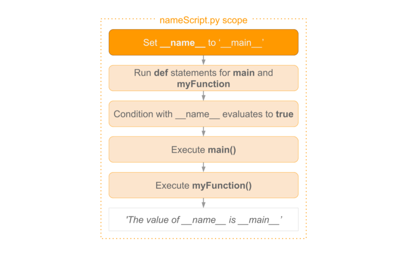
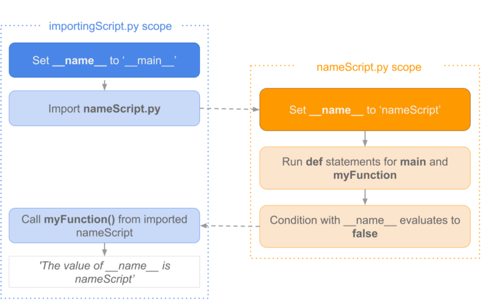

# `__name__` - A Special Variable

## Table of Contents

<!-- START doctoc generated TOC please keep comment here to allow auto update -->
<!-- DON'T EDIT THIS SECTION, INSTEAD RE-RUN doctoc TO UPDATE -->

- [Introduction](#introduction)
- [Scenario 1 - Run The Script](#scenario-1---run-the-script)
- [Scenario 2 - Import The Script In Another Script](#scenario-2---import-the-script-in-another-script)
- [Conclusion](#conclusion)
- [References](#references)

<!-- END doctoc generated TOC please keep comment here to allow auto update -->

## Introduction

You've most likely seen the `__name__` variable
when you've gone through Python code.

<!-- AUTO-GENERATED-CONTENT:START (CODE:src=labs/introduction/example.py) -->
<!-- The below code snippet is automatically added from labs/introduction/example.py -->

```py
def main():
    print("Hello")


if __name__ == "__main__":
    main()
```

<!-- AUTO-GENERATED-CONTENT:END -->

<!-- AUTO-GENERATED-CONTENT:START (CODE:src=labs/introduction/example.console) -->
<!-- The below code snippet is automatically added from labs/introduction/example.console -->

```console
+ python example.py
Hello
```

<!-- AUTO-GENERATED-CONTENT:END -->

> How you can make use of this variable to create modules in Python.

The `__name__` variable is a special Python variable.
It gets its value depending on how we execute the containing script.

Sometimes you write a script with functions that might be useful in other scripts as well.
In Python, you can import that script as a module in another script.

Thanks to this special variable,
you can decide whether you want to run the script.
Or that you want to import the functions defined in the script.

- When you run your script,
  the `__name__` variable equals `__main__`.
- When you import the containing script, it will contain the name of the script.

## Scenario 1 - Run The Script

Suppose we wrote the script nameScript.py as follows:

<!-- AUTO-GENERATED-CONTENT:START (CODE:src=labs/scenario-1/name_script.py) -->
<!-- The below code snippet is automatically added from labs/scenario-1/name_script.py -->

```py
def myFunction():
    print("The value of __name__ is " + __name__)


def main():
    myFunction()


if __name__ == "__main__":
    main()
```

<!-- AUTO-GENERATED-CONTENT:END -->

If you run `nameScript.py`, the process below is followed.

<div align="center"></div>

Before all other code is run,
the `__name__` variable is set to `__main__`.
After that, the main and myFunction def statements are run.
Because the condition evaluates to true, the main function is called.
This, in turn, calls myFunction. This prints out the value of `__main__`.

## Scenario 2 - Import The Script In Another Script

<!-- AUTO-GENERATED-CONTENT:START (CODE:src=labs/scenario-2/importing_script.py) -->
<!-- The below code snippet is automatically added from labs/scenario-2/importing_script.py -->

```py

```

<!-- AUTO-GENERATED-CONTENT:END -->

If we want to re-use myFunction in another script,
for example importingScript.py, we can import nameScript.py as a module.

The code in importingScript.py could be as follows:

```python
import nameScript as ns
```

```python
ns.myFunction()
```

We then have two scopes: one of importingScript and the second scope of nameScript.
In the illustration,
you'll see how it differs from the first use case.

<div align="center"></div>

In importingScript.py the `__name__` variable is set to `__main__`.
By importing nameScript, Python starts looking for a file by adding `.py` to the module name.
It then runs the code contained in the imported file.

But this time it is set to nameScript.
Again the def statements for main and myFunction are run.
But, now the condition evaluates to false and main is not called.

In `importingScript.py` we call myFunction which outputs nameScript.
NameScript is known to myFunction when that function was defined.

If you would print `__name__` in the importingScript,
this would output `__main__`.
The reason for this is that Python uses the value known in the scope of importingScript.

## Conclusion

In this short article,
I explained how you can use the `__name__` variable to write modules.
You can also run these modules on their own.
This can be done by making use of how the values of these variables change
depending on where they occur.

## References

- [What's in a (Python's) `__name__`?](https://www.freecodecamp.org/news/whats-in-a-python-s-name-506262fe61e8)
- [`__name__` (A Special variable) in Python](https://www.tutorialspoint.com/name-a-special-variable-in-python)
